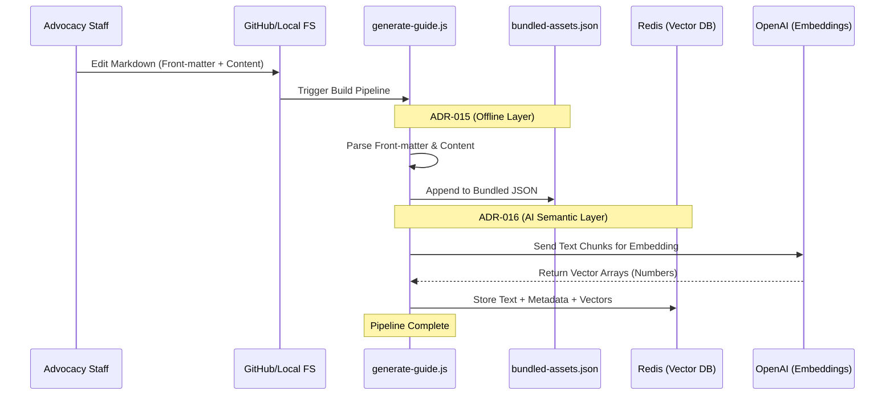

# Ingestion Flow: Staff Update to Redis/App

Main: [ADR-015_SSG_ENGINE_SELECTION](./ADR-015_SSG_ENGINE_SELECTION.md)
Related: [ADR-016_AI_SEMANTIC_LAYER](./ADR-016_AI_SEMANTIC_LAYER.md)

This diagram tracks how a Markdown edit becomes a searchable AI vector (ADR-016) and an offline JSON asset.

